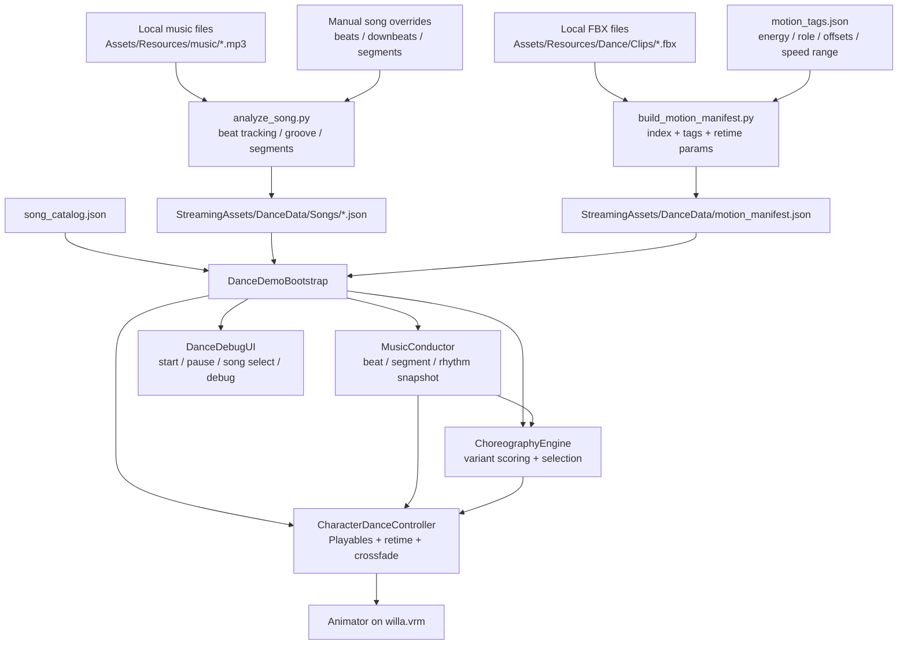
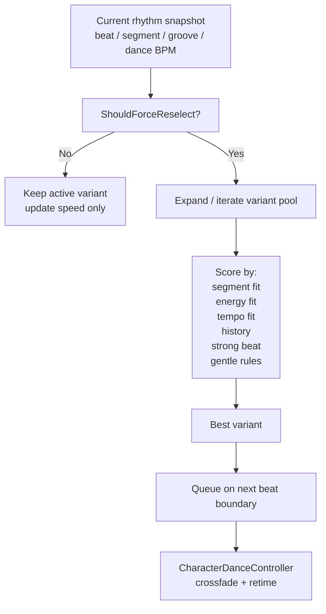
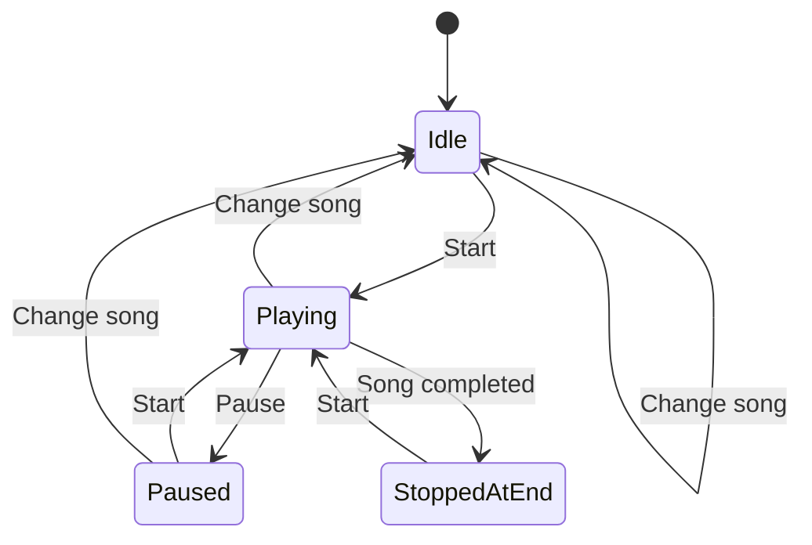

# DigitalDance System Architecture

This document explains the current code and data flow for the Unity VRM dance demo. It is written against the live implementation in:

- `Assets/Scripts/Dance/DanceDemoBootstrap.cs`
- `Assets/Scripts/Dance/MusicConductor.cs`
- `Assets/Scripts/Dance/ChoreographyEngine.cs`
- `Assets/Scripts/Dance/CharacterDanceController.cs`
- `Assets/Scripts/Dance/DanceDebugUI.cs`
- `Assets/Scripts/Dance/DanceDataModels.cs`
- `tools/dance_pipeline/analyze_song.py`
- `tools/dance_pipeline/build_motion_manifest.py`

## 1. System Goals

The project is a desktop-first Unity 2022.3 VRM dance demo with these constraints:

- one runtime VRM avatar: `willa.vrm`
- local manually downloaded Mixamo FBX dance motions
- local music files under `Assets/Resources/music`
- offline Python preprocessing
- runtime choreography driven by JSON, not hardcoded animator states

The system is split into two stages:

1. offline preprocessing in Python
2. runtime music, choreography, animation, and UI in Unity

## 2. High-Level Data Flow

## 3. Runtime Module Responsibilities

### 3.1 `DanceDemoBootstrap`

File: `Assets/Scripts/Dance/DanceDemoBootstrap.cs`

This is the top-level orchestration entry point.

Responsibilities:

- create the runtime bootstrap object after scene load
- load `song_catalog.json`, song analysis JSON, and `motion_manifest.json`
- resolve `AudioClip` and `AnimationClip` resources
- load or recover the `willa.vrm` avatar
- initialize `MusicConductor`
- initialize `ChoreographyEngine`
- initialize `CharacterDanceController`
- own playback state:
  - `Idle`
  - `Playing`
  - `Paused`
  - `StoppedAtEnd`
- handle UI events:
  - start
  - pause
  - song switch
  - reload
  - quit

Important behavior:

- startup enters `Idle`
- startup does not auto-play
- switching songs stops playback, resets pose, and returns to `Idle`
- end-of-song stops and resets pose

### 3.2 `MusicConductor`

File: `Assets/Scripts/Dance/MusicConductor.cs`

This component turns song analysis JSON into a live rhythm clock.

Core responsibilities:

- schedule audio playback with `AudioSettings.dspTime`
- track current song time
- advance beat index and segment index
- emit:
  - `BeatChanged`
  - `SegmentChanged`
  - `PlaybackCompleted`
- build a per-frame `MusicRhythmSnapshot`

`MusicRhythmSnapshot` carries the live rhythm interpretation used by choreography and retiming, including:

- raw/local BPM
- dance BPM
- beat phase
- beat grouping
- groove strength
- strong beat window
- strong beat reason
- perceived downbeat
- energy mode

For `audio1`, the conductor now uses manual half-time beats generated offline, so the runtime no longer relies on `148 BPM -> beatGrouping=2` compensation.

### 3.3 `ChoreographyEngine`

File: `Assets/Scripts/Dance/ChoreographyEngine.cs`

This component is the rule-based dance selector.

It does not pick from raw clips only. It first expands every motion into a variant pool:

- clip id
- role: `loop` or `accent`
- `startOffsetBeats`
- `sliceBeats`
- `varietyGroup`

Then it scores candidates against the current context:

- current segment label
- target energy band
- dance BPM fit
- recent clip history
- recent variety-group history
- recent role history
- clamp stress / retime stress
- strong beat window
- gentle mode vs balanced/driving mode

For slow songs in `gentle` mode, the current implementation deliberately biases toward:

- `low_energy` and `mid_energy`
- longer holds
- fewer accents
- cleaner entry offsets
- fewer short slices
- less group jumping

That is the main choreography-side control for calm songs like `audio1`.

### 3.4 `CharacterDanceController`

File: `Assets/Scripts/Dance/CharacterDanceController.cs`

This is the animation playback layer. It uses a two-slot `PlayableGraph` mixer instead of a large Animator state machine.

Responsibilities:

- initialize a graph targeting the avatar `Animator`
- queue transitions for the next beat window
- crossfade between clips
- loop clips safely
- pause / resume graph playback
- stop and reset the avatar to default pose
- continuously retime active playback speed

Playback speed is computed from:

- `danceLocalBpm / nativeBpm`
- groove influence
- beat-phase pulse
- energy mode adjustments
- per-clip `speedMin` / `speedMax`

For `gentle` mode the controller explicitly:

- raises smoothing
- lowers groove influence
- weakens beat pulse
- clamps to a softer speed range

So the clip should breathe with the song rather than twitch on every small beat.

### 3.5 `DanceDebugUI`

File: `Assets/Scripts/Dance/DanceDebugUI.cs`

This renders two UI layers:

- left debug panel
- right compact playback / choreography card

The compact card is the product-facing control surface:

- song selector
- start
- pause
- compact choreography summary

The debug panel is the engineering-facing inspection layer:

- playback state
- song id
- raw/local/dance BPM
- grouping / mode
- speed / target speed
- clip id / clip time
- strong beat reason
- status text

`Space` / `P` auto-trigger behavior has been removed so startup state stays deterministic.

## 4. Offline Data Pipeline

## 4.1 Song Analysis

File: `tools/dance_pipeline/analyze_song.py`

This script reads local audio and emits Unity-friendly song analysis JSON.

Default analysis includes:

- duration
- BPM
- beat times
- beat windows
- groove envelope
- tempo map
- coarse segments

It now also supports explicit manual overrides:

- `beats`
- `downbeats`
- `beats_per_bar`
- `segments`
- `bpm`

Priority rule:

- if overrides contain `beats`, those beats become the truth source
- `beatWindows`, `downbeats`, and `tempoMap` are rebuilt from those beats
- groove data still comes from automatic signal analysis

This is the mechanism now used for `audio1`.

### `audio1` manual beat override

File: `tools/dance_pipeline/config/song_overrides.audio1.json`

`audio1` is a slow song and the automatic beat tracker previously locked onto a pulse that was too fast. The fix is:

- provide a hand-curated beat list at the intended slow pulse
- keep `energyMode = gentle`
- set runtime `beatGrouping = 1`

The resulting analysis JSON is:

- `Assets/StreamingAssets/DanceData/Songs/audio1_mp3.json`

## 4.2 Motion Manifest

File: `tools/dance_pipeline/build_motion_manifest.py`

This script scans local FBX files and merges tag metadata into one manifest.

Per-clip fields include:

- `energyBand`
- `preferredSegments`
- `phraseBeats`
- `nativeBpm`
- `speedMin`
- `speedMax`
- `retimeProfile`
- `varietyGroup`
- `role`
- `entryOffsetsBeats`
- `sliceBeatsOptions`
- `accentBias`

Tag source:

- `tools/dance_pipeline/config/motion_tags.json`

This data is the main authoring surface for choreography quality.

## 5. Rhythm Processing Logic

The rhythm stack is intentionally split into two layers:

1. offline beat truth
2. runtime beat interpretation

### Offline

Offline analysis decides:

- where beats are
- where downbeats are
- how the song is segmented
- what the groove envelope looks like

### Runtime

Runtime decides:

- where we are inside the current beat
- whether the current moment is a strong beat window
- how much to retime the current clip
- whether to hold, switch, or accent

This separation matters because it lets the project correct slow songs with manual beats while keeping the runtime deterministic.

## 6. Choreography Decision Flow

The current priority order is:

1. continuity
2. tempo fit
3. segment fit
4. energy fit
5. diversity

That ordering is deliberate. The system prefers a stable believable dance over frequent changes.

## 7. Playback State Flow

Expected product behavior:

- launch: idle pose, no audio, no dance
- choose song
- click `Start`
- click `Pause` to freeze both audio and dance
- switch songs to return to idle pose
- click `Start` again to begin the newly selected song

## 8. Deploying On Another Device

The repository is designed so another device can clone and run the project if these conditions are met:

- Unity `2022.3.62f3` is installed
- macOS desktop target is available
- Python 3 is available only if you need to regenerate JSON

You do not need to commit:

- `Library`
- `Logs`
- `Builds`
- `.venv`

You do need to commit:

- `Assets`
- `Packages`
- `ProjectSettings`
- `tools`
- `docs`
- `README.md`

If the committed repo already contains:

- `Assets/Resources/music/*.mp3`
- `Assets/Resources/Dance/Clips/*.fbx`
- `Assets/StreamingAssets/DanceData/*.json`

then another device can open the Unity project and run it without regenerating pipeline outputs.

## 9. Recommended Next Quality Step

If `audio1` now feels closer to the song but transitions still snap too hard, the next technical step should be:

- same-group transition preference
- cleaner offset-entry constraints
- light pose-compatibility scoring

That work should be done after beat truth is stable, not before.
