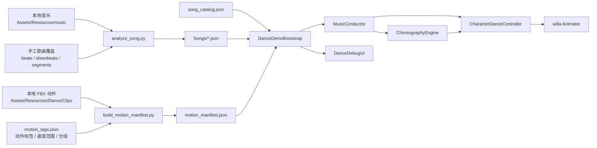
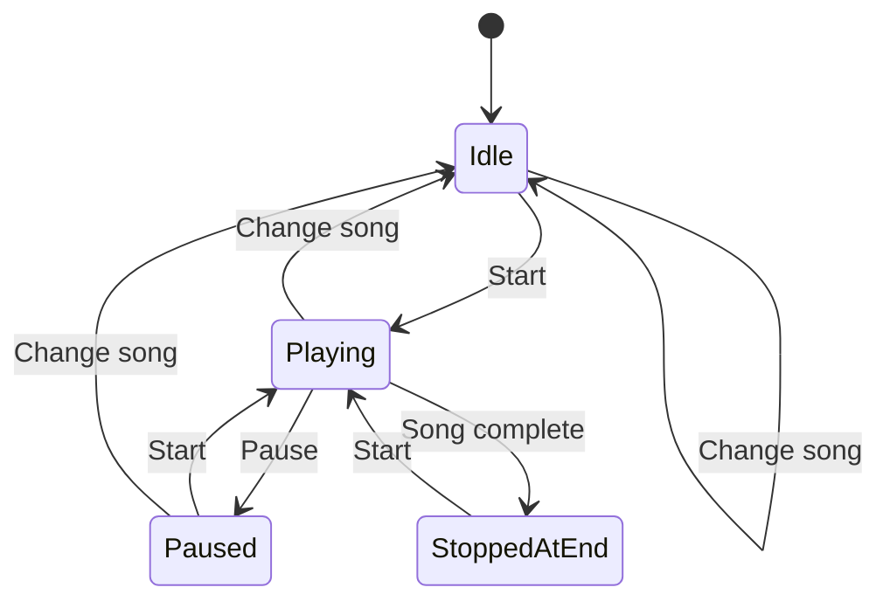
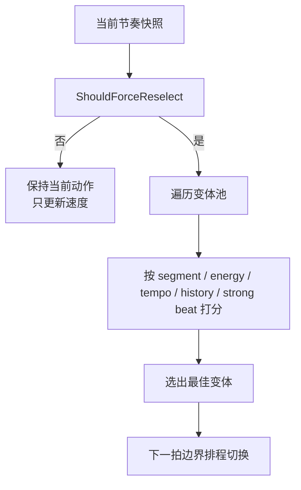

# DigitalDance 功能逻辑说明

这份文档面向当前项目的开发、维护和交接。重点解释：

- 系统的整体功能结构
- 音乐数据如何处理
- 节奏如何进入运行时
- 舞蹈编排如何选择动作
- 动作如何根据音乐做连续变速
- 播放、暂停、切歌的状态机如何工作

对应的核心代码文件：

- `/Users/alex/Desktop/codex project/3d-digital/3d-digital-human/Assets/Scripts/Dance/DanceDemoBootstrap.cs`
- `/Users/alex/Desktop/codex project/3d-digital/3d-digital-human/Assets/Scripts/Dance/MusicConductor.cs`
- `/Users/alex/Desktop/codex project/3d-digital/3d-digital-human/Assets/Scripts/Dance/ChoreographyEngine.cs`
- `/Users/alex/Desktop/codex project/3d-digital/3d-digital-human/Assets/Scripts/Dance/CharacterDanceController.cs`
- `/Users/alex/Desktop/codex project/3d-digital/3d-digital-human/Assets/Scripts/Dance/DanceDebugUI.cs`
- `/Users/alex/Desktop/codex project/3d-digital/3d-digital-human/Assets/Scripts/Dance/DanceDataModels.cs`
- `/Users/alex/Desktop/codex project/3d-digital/3d-digital-human/tools/dance_pipeline/analyze_song.py`
- `/Users/alex/Desktop/codex project/3d-digital/3d-digital-human/tools/dance_pipeline/build_motion_manifest.py`

## 1. 系统目标

当前项目的目标不是做一个固定时间线的“预烘焙舞蹈视频”，而是做一个数据驱动的实时舞蹈系统。

它的基本原则是：

- 音乐分析在离线完成
- 舞蹈动作索引和标签在离线完成
- Unity 运行时只做读取、跟踪、编排、播放和调试显示
- 编舞规则主要由 JSON 和评分逻辑控制，而不是硬编码在 Animator 状态机里

## 2. 总体结构

可以把系统看成两段：

1. 离线数据准备
2. 运行时舞蹈驱动

## 3. 离线数据处理

## 3.1 歌曲分析

脚本：

- `/Users/alex/Desktop/codex project/3d-digital/3d-digital-human/tools/dance_pipeline/analyze_song.py`

输出：

- `Assets/StreamingAssets/DanceData/Songs/*.json`

主要输出字段：

- `bpm`
- `beats`
- `beatWindows`
- `downbeats`
- `grooveEnvelope`
- `tempoMap`
- `segments`

这里最关键的一点是：

- 如果 override 里提供了 `beats`
- 那么运行时使用的拍点真相源就不再是自动 beat tracking
- 而是你提供的手工拍点

这就是 `audio1` 当前的修正方式。

### 为什么要手工拍点覆盖

慢歌最容易被自动分析错误地锁到更细碎的脉冲上。  
一旦底层 beat grid 错了，后面的：

- 强拍判断
- 节奏快慢
- 换舞时机
- 动作变速

都会一起错。

所以当前实现里，`audio1` 使用的是“手工慢拍真相源”，而不是“错误快拍再做 beatGrouping 补偿”。

## 3.2 动作索引和标签

脚本：

- `/Users/alex/Desktop/codex project/3d-digital/3d-digital-human/tools/dance_pipeline/build_motion_manifest.py`

输入：

- `Assets/Resources/Dance/Clips/*.fbx`
- `tools/dance_pipeline/config/motion_tags.json`

输出：

- `Assets/StreamingAssets/DanceData/motion_manifest.json`

每个动作条目里最重要的字段：

- `clipId`
- `energyBand`
- `preferredSegments`
- `nativeBpm`
- `speedMin`
- `speedMax`
- `retimeProfile`
- `varietyGroup`
- `role`
- `entryOffsetsBeats`
- `sliceBeatsOptions`

它们分别解决的问题：

- `energyBand`
  决定这支舞更偏安静、中等还是高能
- `preferredSegments`
  决定这支舞更适合歌曲哪一段
- `nativeBpm`
  决定动作原生节奏速度
- `speedMin / speedMax`
  决定这支舞可被拉伸或放慢到什么范围
- `varietyGroup`
  决定哪些动作算同一类，方便连续性控制
- `role`
  决定它更适合主循环还是重拍 accent
- `entryOffsetsBeats / sliceBeatsOptions`
  决定这支舞可以从哪些拍点进入，以及可切成多长的乐句

## 4. 运行时核心模块

## 4.1 `DanceDemoBootstrap`

文件：

- `/Users/alex/Desktop/codex project/3d-digital/3d-digital-human/Assets/Scripts/Dance/DanceDemoBootstrap.cs`

它是整个运行时的总控。

负责：

- 场景启动时创建系统
- 加载曲库和选中歌曲
- 加载动作 manifest
- 解析 `AudioClip` 和 `AnimationClip`
- 确保 `willa` 可用
- 初始化 conductor / choreography / controller / UI
- 管理播放状态机

当前播放状态有 4 个：

- `Idle`
- `Playing`
- `Paused`
- `StoppedAtEnd`

状态机目标是：

- 启动后默认 `Idle`
- 不自动播放
- 切歌后回到默认站姿并保持 `Idle`
- 只有点 `Start` 才开始
- `Pause` 同时冻结音乐和舞蹈

## 4.2 `MusicConductor`

文件：

- `/Users/alex/Desktop/codex project/3d-digital/3d-digital-human/Assets/Scripts/Dance/MusicConductor.cs`

作用：

- 用 `AudioSettings.dspTime` 做高精度音频时钟
- 跟踪当前歌曲时间、当前拍、当前小节、当前段落
- 生成运行时节奏快照 `MusicRhythmSnapshot`

节奏快照里最重要的字段：

- `LocalBpm`
- `DanceLocalBpm`
- `BeatPhase`
- `GrooveStrength`
- `IsDownbeat`
- `IsPerceivedDownbeat`
- `IsStrongBeatWindow`
- `StrongBeatReason`
- `BeatGrouping`
- `EnergyMode`

这里需要区分两个概念：

- `LocalBpm`
  原始拍窗给出的局部 BPM
- `DanceLocalBpm`
  真正用来驱动动画速度和编舞判断的 BPM

对于 `audio1`，因为现在离线阶段已经提供了正确的慢拍节奏，所以运行时的 `DanceLocalBpm` 直接来自手工慢拍，不再靠运行时“二次折半”。

## 4.3 `ChoreographyEngine`

文件：

- `/Users/alex/Desktop/codex project/3d-digital/3d-digital-human/Assets/Scripts/Dance/ChoreographyEngine.cs`

这个模块的核心不是“直接从 40 支动作里选一支”，而是：

1. 先把动作展开成“动作变体池”
2. 再对每个候选变体打分
3. 最后选分数最高的一项

### 动作变体池

每个变体包含：

- `variantId`
- `sourceClip`
- `varietyGroup`
- `role`
- `startOffsetBeats`
- `sliceBeats`

也就是说，一支动作不只是“整条播一次”，还可以有：

- 不同入口偏移
- 不同切片长度
- loop 角色
- accent 角色

### 编舞评分考虑什么

评分大致按这些维度叠加：

- 段落匹配
- 能量带匹配
- tempo fit
- 最近历史去重
- variety group 连续性
- role 连续性
- 强拍窗口
- retime stress / clamp hit
- gentle / balanced / driving 模式差异

### `gentle` 模式下做了什么

当歌曲 profile 是 `gentle`，当前实现会更严格地压住激烈编舞：

- 更偏 `low_energy / mid_energy`
- 更少使用高能动作
- 更少使用 accent
- 更长的最短持有拍数
- 更不鼓励 group jump
- 更偏长句和干净入口

这也是为什么同一套动作库在 `audio` 和 `audio1` 上表现会不同。

### 编舞决策流程

## 4.4 `CharacterDanceController`

文件：

- `/Users/alex/Desktop/codex project/3d-digital/3d-digital-human/Assets/Scripts/Dance/CharacterDanceController.cs`

作用：

- 创建 `PlayableGraph`
- 管理双槽混合器
- 安排下一个动作
- 在拍点触发切换
- 执行交叉淡入
- 持续调整播放速度
- 支持暂停 / 恢复 / 停止并恢复默认站姿

### 为什么不用大 Animator 状态机

因为当前系统是数据驱动的。  
动作不只是固定状态，而是带：

- clip 变体
- 切片
- 偏移入口
- 按拍排程
- 实时速度调节

这种结构更适合用 Playables。

### 速度适配怎么做

核心逻辑是：

1. 读取当前动作的 `nativeBpm`
2. 计算 `danceLocalBpm / nativeBpm`
3. 叠加 groove 和拍内 pulse
4. clamp 到动作允许速度范围
5. 用 smoothing 平滑逼近目标速度

对于 `gentle` 模式，控制器还会进一步：

- 降低 groove influence
- 弱化拍内 pulse
- 增强 smoothing
- 放宽低速下限
- 压住高速上限

目标不是做“每拍强抖”，而是做“连续、平滑、有呼吸感的变速”。

## 4.5 `DanceDebugUI`

文件：

- `/Users/alex/Desktop/codex project/3d-digital/3d-digital-human/Assets/Scripts/Dance/DanceDebugUI.cs`

它有两层：

- 左上角调试层
- 右下角产品层

右下角是实际操作层：

- 选歌
- `Start`
- `Pause`
- 编排摘要

左上角是调试层：

- 当前播放状态
- song id
- Raw / Local / Dance BPM
- Energy mode
- 当前速度 / 目标速度
- 当前动作
- 当前动作时间
- Strong Beat / Reason

现在已经去掉了启动时可能误触发播放的键盘快捷键路径，所以播放完全以 UI 按钮为准。

## 5. 当前音乐与舞蹈的匹配逻辑

从高层看，音乐与舞蹈的匹配分成三层：

### 第一层：拍点真相

由 `Songs/*.json` 提供：

- beat grid
- beat windows
- segments

### 第二层：运行时节奏解释

由 `MusicConductor` 提供：

- 当前在哪一拍
- 当前节奏速度
- 当前 groove 强度
- 当前是否强拍窗口

### 第三层：舞蹈响应

由两个模块共同完成：

- `ChoreographyEngine`
  负责选什么动作
- `CharacterDanceController`
  负责这个动作播多快、何时切

## 6. `audio1` 为什么要单独处理

`audio1` 的问题不是动作库不够，而是：

- 自动 beat tracking 容易把慢歌识别到更细碎的拍点
- 一旦 beat grid 偏快，运行时再聪明也只是建立在错误输入上

因此当前对 `audio1` 的优化思路是：

1. 先修输入：手工 beat override
2. 再修运行时：gentle 模式收紧
3. 最后才考虑过渡质量

所以 `audio1` 现在的策略是：

- 手工慢拍为真相源
- `beatGrouping = 1`
- `tempoScale = 1.0`
- `energyMode = gentle`

## 7. 数据与代码的映射关系

### 曲库入口

- `Assets/StreamingAssets/DanceData/song_catalog.json`

对应数据模型：

- `SongCatalogData`
- `SongCatalogEntry`
- `SongPlaybackProfile`

### 单曲分析

- `Assets/StreamingAssets/DanceData/Songs/*.json`

对应数据模型：

- `SongAnalysisData`
- `BeatWindowData`
- `SongSegmentData`
- `TempoMapEntryData`
- `GrooveSampleData`

### 动作清单

- `Assets/StreamingAssets/DanceData/motion_manifest.json`

对应数据模型：

- `MotionManifestData`
- `MotionClipEntry`
- `DanceVariantCandidate`

### 运行时上下文

对应数据模型：

- `MusicRhythmSnapshot`
- `DanceSelectionContext`
- `DanceSelectionResult`
- `DanceDebugState`

## 8. 当前最值得继续优化的方向

如果未来还要继续提升编舞质量，优先级建议是：

1. 慢歌继续补手工 beat / segment overrides
2. 同组动作优先过渡
3. pose compatibility 评分
4. 针对每首歌再细化 `SongPlaybackProfile`

不要反过来先做更复杂的过渡系统。  
因为节拍输入如果本身错了，越复杂的运行时算法只会放大错误。
